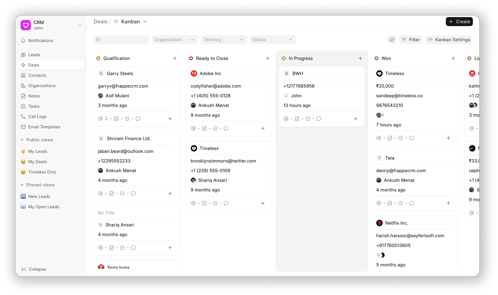

<div align="center" markdown="1">

<a href="https://frappe.io/products/crm">
    
</a>

<h1>Frappe CRM</h1>

**Simplify Sales, Amplify Relationships**



[Live Demo](https://frappecrm-demo.frappe.cloud/api/method/crm.api.demo.login) - [Website](https://frappe.io/crm) - [Documentation](https://docs.frappe.io/crm)

</div>

## Frappe CRM

Frappe CRM is a simple, affordable, open-source CRM tool designed for modern sales teams with unlimited users. Frappe CRM is crafted for providing a great user experience, packed with features for core CRM activities helping you build strong customer relationships while keeping things clean and organised.

## Motivation

The motivation behind building Frappe CRM stems from the need for a simple, customizable, and open-source solution tailored to modern business needs. Many existing CRMs are either too complex, overly generic, or locked behind steep pricing models that hinder accessibility and flexibility. Frappe CRM was designed to bridge this gap, offering a tool that empowers businesses to manage their customer relationships seamlessly while being easy to adapt to specific workflows. Built on the Frappe framework, it prioritizes usability, extensibility, and affordability, making it an ideal choice for growing teams and organizations looking for a CRM that aligns with their unique processes.

## Key Features

-   **User-Friendly and Flexible:** A simple, intuitive interface that’s easy to navigate and highly customizable, enabling teams to adapt it to their specific processes effortlessly.
-   **All-in-One Lead/Deal Page:** Consolidate all essential actions and details—like activities, comments, notes, tasks, and more—into a single page for a seamless workflow experience.
-   **Kanban View:** Manage leads and deals visually with a drag-and-drop Kanban board, offering clarity and efficiency in tracking progress across stages.
-   **Custom Views:** Design personalized views to organize and display leads and deals using custom filters, sorting, and columns, ensuring quick access to the most relevant information.

## Integrations

-   **Twilio:** Integrate Twilio to make and receive calls from the CRM. You can also record calls. It is a built-in integration.
-   **WhatsApp:** Integrate WhatsApp to send and receive messages from the CRM. [Frappe WhatsApp](https://github.com/shridarpatil/frappe_whatsapp) is used for this integration.
-   **ERPNext:** Integrate with [ERPNext](https://erpnext.com) to extend the CRM capabilities to include invoicing, accounting, and more.

<details>
<summary>Screenshots</summary>


</details>

## Under the Hood

-   [**Frappe Framework**](https://github.com/frappe/frappe): A full-stack web application framework written in Python and Javascript. The framework provides a robust foundation for building web applications, including a database abstraction layer, user authentication, and a REST API.

-   [**Frappe UI**](https://github.com/frappe/frappe-ui): A Vue-based UI library, to provide a modern user interface. The Frappe UI library provides a variety of components that can be used to build single-page applications on top of the Frappe Framework.

## Production Setup

### Managed Hosting

You can try [Frappe Cloud](https://frappecloud.com), a simple, user-friendly and sophisticated [open-source](https://github.com/frappe/press) platform to host Frappe applications with peace of mind.

It takes care of installation, setup, upgrades, monitoring, maintenance and support of your Frappe deployments. It is a fully featured developer platform with an ability to manage and control multiple Frappe deployments.

<div>
	<a href="https://frappecloud.com/crm/signup" target="_blank">
		<picture>
			<source media="(prefers-color-scheme: dark)" srcset="https://frappe.io/files/try-on-fc-white.png">
			
		</picture>
	</a>
</div>

### Self Hosting

Follow these steps to set up Frappe CRM in production:

**Step 1**: Download the easy install script

```bash
wget https://frappe.io/easy-install.py
```

**Step 2**: Run the deployment command

```bash
python3 ./easy-install.py deploy \
    --project=crm_prod_setup \
    --email=your_email.example.com \
    --image=ghcr.io/frappe/crm \
    --version=stable \
    --app=crm \
    --sitename subdomain.domain.tld
```

Replace the following parameters with your values:

-   `your_email.example.com`: Your email address
-   `subdomain.domain.tld`: Your domain name where CRM will be hosted

The script will set up a production-ready instance of Frappe CRM with all the necessary configurations in about 5 minutes.

## Development Setup

### Docker

You need Docker, docker-compose and git setup on your machine. Refer [Docker documentation](https://docs.docker.com/). After that, follow below steps:

**Step 1**: Setup folder and download the required files

    mkdir frappe-crm
    cd frappe-crm

    # Download the docker-compose file
    wget -O docker-compose.yml https://raw.githubusercontent.com/frappe/crm/develop/docker/docker-compose.yml

    # Download the setup script
    wget -O init.sh https://raw.githubusercontent.com/frappe/crm/develop/docker/init.sh

**Step 2**: Run the container and daemonize it

    docker compose up -d

**Step 3**: The site [http://crm.localhost:8000/crm](http://crm.localhost:8000/crm) should now be available. The default credentials are:

-   Username: Administrator
-   Password: admin

### Codespaces

1. Open [this link](https://github.com/codespaces/new?hide_repo_select=true&ref=master&repo=668199241&skip_quickstart=true&machine=standardLinux32gb&devcontainer_path=.devcontainer%2Fdevcontainer.json&geo=SoutheastAsia) and click on "Create Codespace".
2. Wait for initialization (~15 mins).
3. Run `bench start` from the terminal tab.
4. Click on the link beside "8000" port under "Ports" tab.
5. Log in with "Administrator" as the username and "admin" as the password.
6. Go to `<random-id>.github.dev/crm` to access the crm interface.

### Local

1. [Install Bench](https://github.com/frappe/bench).
2. Install Frappe CRM app:
    ```sh
    $ bench get-app crm
    ```
3. Create a site with the crm app:
    ```sh
    $ bench --site sitename.localhost install-app crm
    ```
4. Open the site in the browser:
    ```sh
    $ bench browse sitename.localhost --user Administrator
    ```
5. Access the crm page at `sitename.localhost:8000/crm` in your web browser.

### Frontend Development Setup

The Frappe CRM's frontend is a Vue.js application located in the `frontend/src` directory. Follow these steps to set up the frontend development environment:

1. Navigate to the app directory:

    ```bash
    cd apps/crm
    ```

2. Install dependencies:

    ```bash
    yarn install
    ```

3. Add the following line in your site's `site_config.json` file

    ```json
    "ignore_csrf": 1
    ```

4. Start the development server:

    ```bash
    yarn dev
    ```

5. Access the development site:
    - Open `http://crm.localhost:8080/crm` in your browser
    - Any changes to files in `frontend/src` will automatically reload in the browser

## Learn and connect

-   [Telegram Public Group](https://t.me/frappecrm)
-   [Discuss Forum](https://discuss.frappe.io/c/frappe-crm)
-   [Documentation](https://docs.frappe.io/crm)
-   [YouTube](https://frappe.io)

<h2></h2>
<div align="center" style="padding-top: 0.75rem;">
	<a href="https://frappe.io" target="_blank">
		<picture>
			<source media="(prefers-color-scheme: dark)" srcset="https://frappe.io/files/Frappe-white.png">
			
		</picture>
	</a>
</div>
