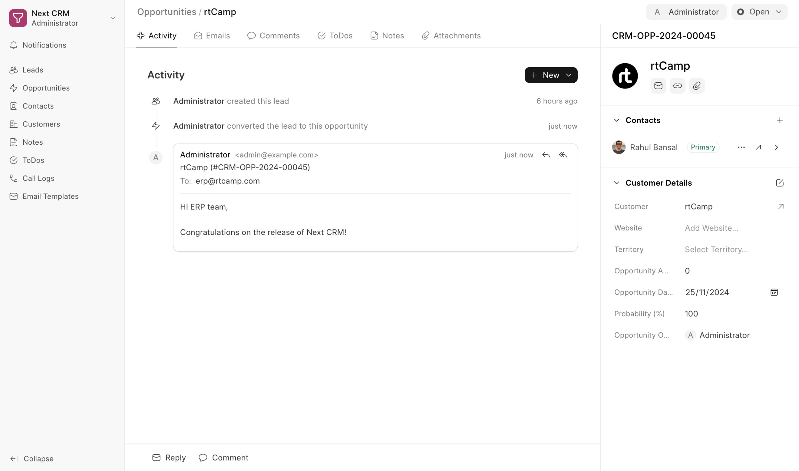

<div align="center">
    
    <h1>Next CRM</h1>
</div>

<div align="center">
    <a href="https://frappe.io/products/crm">
        
    </a>
</div>

<p align="center">
    <a href="https://img.shields.io/github/license/frappe/crm">
        
    </a>
</p>

## Key Features

-   **Views:** Create custom views which is a combination of filters, sort and columns.
    -   **Pinned View:** Pin important leads and opportunities in the sidebar.
    -   **Public View:** Share views with all users.
    -   **Saved View:** Save views for later use.
-   **Email Communication:** Send and receive emails directly from the Lead/Opportunity Page.
-   **Email Templates:** Create and use email templates for faster communication.
-   **Comments:** Add comments to leads and opportunities to keep track of the conversation.
-   **Notifications:** Get notified when someone mentions you in a comment.
-   **Service Level Agreement:** Set SLA for leads and opportunities and get notified when the SLA is breached.
-   **Assignment Rule:** Automatically assign leads and opportunities to users based on the criteria.
-   **ToDos:** Create todos for leads and opportunity.
-   **Notes:** Add notes to leads and opportunity.
-   **Call Logs:** See the call logs with call details and recordings.

## Getting Started

### Local Setup

1. [Install Bench](https://github.com/frappe/bench).
2. [Install ERPNext](https://github.com/frappe/erpnext)
2. Get the Next CRM app:
    ```sh
    $ bench get-app https://github.com/rtCamp/next-crm --branch next-develop
    ```
3. Create a site with the crm app:
    ```sh
    $ bench --site sitename.localhost install-app next_crm
    ```
4. Open the site in the browser:
    ```sh
    $ bench browse sitename.localhost --user Administrator
    ```
5. Access the crm page at `sitename.localhost:8000/next-crm` in your web browser.

### Changes other than DocType

1. App renamed to Next CRM
2. URL changed from /crm to /next-crm
3. Lead is compulsory to create Opportunity (being reconsidered)
4. ERPNext integration enabled by default

### Removed Features
1. CRM Invitation –  Permissions from the ERPNext CRM module are used directly.
2. Ability to link to ERPNext on a different site –  Not required as this is tightly integrated with the ERPNext CRM module.
