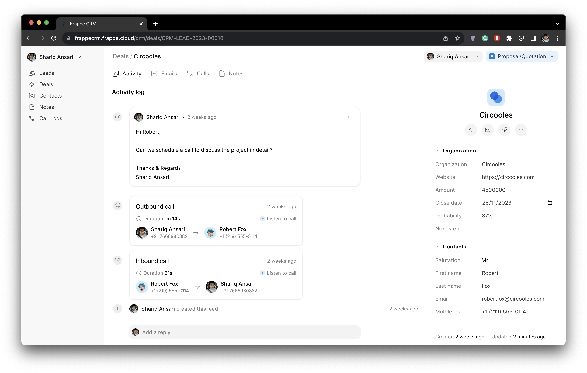
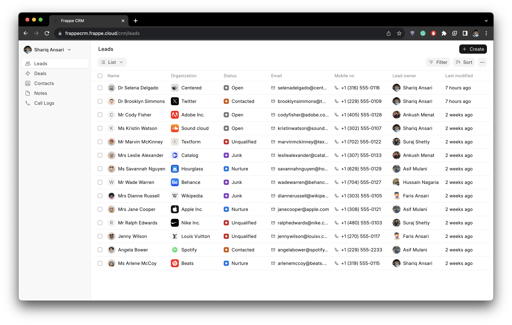
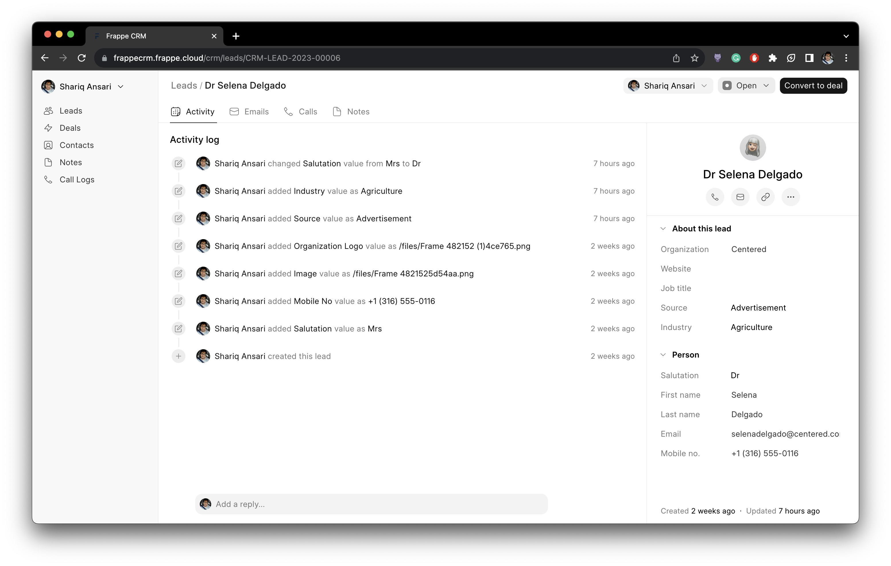

<p align="center">
  
  <p align="center" style="font-weight: bold;">Modern, open-source, CRM solution to supercharge your sales operations.</p>
</p>

<p align="center">
    <a href="https://img.shields.io/github/issues/frappe/crm">
        
    </a>
    <a href="https://img.shields.io/github/license/frappe/crm">
        
    </a>
</p>

> **Note:** I am currently not expecting any contributions to this repository. But you can always open an issue if you find any bugs, feature requests, or have any suggestions.




<details>
  <summary>Show more screenshots</summary>

  

  

  

  
</details>

## Getting Started

Currently, this app depends on the `develop` branch of [frappe](https://github.com/frappe/frappe).

1. Setup frappe-bench by following [this guide](https://frappeframework.com/docs/v14/user/en/installation)
1. In the frappe-bench directory, run `bench start` and keep it running. Open a new terminal session and cd into `frappe-bench` directory.
1. Run the following commands:
    ```sh
    bench new-site crm.test
    bench get-app crm
    bench --site crm.test install-app crm
    bench --site crm.test add-to-hosts
    bench --site crm.test browse --user Administrator
    ```
 1. Now, open a new terminal session and cd into `frappe-bench/apps/crm`, and run the following commands:
    ```
    yarn
    yarn dev
    ```
 1. Now, you can access the site on vite dev server at `http://crm.test:8080`