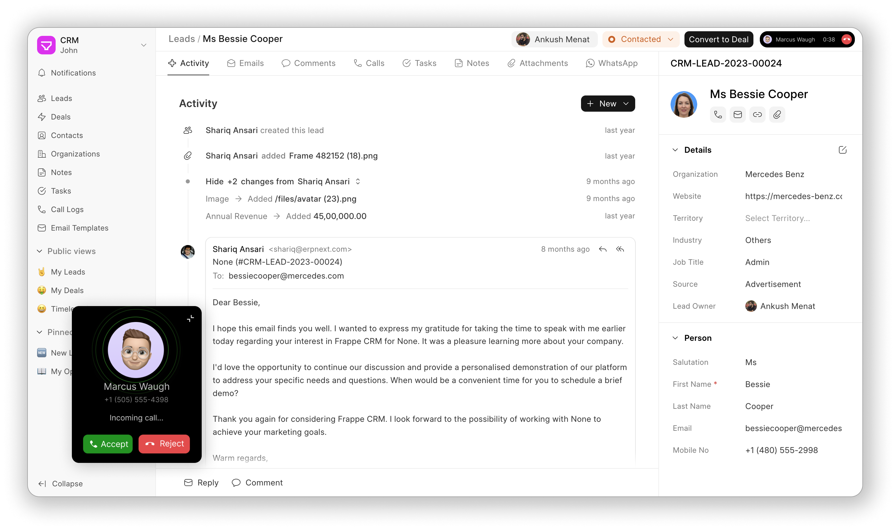

<div align="center" markdown="1">

<a href="https://frappe.io/products/crm">
    
</a>

<h1>Frappe CRM</h1>

**Simplify Sales, Amplify Relationships**

[](https://github.com/frappe/crm/releases)

<div>
    <picture>
        <source media="(prefers-color-scheme: dark)" srcset=".github/screenshots/FrappeCRMHeroImage.png">
        
    </picture>
</div>

[Live Demo](https://frappecrm-demo.frappe.cloud/api/method/crm.api.demo.login) - [Website](https://frappe.io/crm) - [Documentation](https://docs.frappe.io/crm)

</div>

## Frappe CRM

Frappe CRM is a simple, affordable, open-source CRM tool designed for modern sales teams with unlimited users. Frappe CRM is crafted for providing a great user experience, packed with features for core CRM activities helping you build strong customer relationships while keeping things clean and organised.

### Motivation

The motivation behind building Frappe CRM stems from the need for a simple, customizable, and open-source solution tailored to modern business needs. Many existing CRMs are either too complex, overly generic, or locked behind steep pricing models that hinder accessibility and flexibility. Frappe CRM was designed to bridge this gap, offering a tool that empowers businesses to manage their customer relationships seamlessly while being easy to adapt to specific workflows. Built on the Frappe framework, it prioritizes usability, extensibility, and affordability, making it an ideal choice for growing teams and organizations looking for a CRM that aligns with their unique processes.

### Key Features

-   **User-Friendly and Flexible:** A simple, intuitive interface that’s easy to navigate and highly customizable, enabling teams to adapt it to their specific processes effortlessly.
-   **All-in-One Lead/Deal Page:** Consolidate all essential actions and details—like activities, comments, notes, tasks, and more—into a single page for a seamless workflow experience.
-   **Kanban View:** Manage leads and deals visually with a drag-and-drop Kanban board, offering clarity and efficiency in tracking progress across stages.
-   **Custom Views:** Design personalized views to organize and display leads and deals using custom filters, sorting, and columns, ensuring quick access to the most relevant information.

    <details>
    <summary>Screenshots</summary>

    <div>
        <picture>
            <source media="(prefers-color-scheme: dark)" srcset=".github/screenshots/LeadList.png">
            
        </picture>
    </div>
    <div>
        <picture>
            <source media="(prefers-color-scheme: dark)" srcset=".github/screenshots/LeadPage.png">
            
        </picture>
    </div>
    <div>
        <picture>
            <source media="(prefers-color-scheme: dark)" srcset=".github/screenshots/EmailTemplate.png">
            
        </picture>
    </div>
    <div>
        <picture>
            <source media="(prefers-color-scheme: dark)" srcset=".github/screenshots/CallUI.png">
            
        </picture>
    </div>
    <div>
        <picture>
            <source media="(prefers-color-scheme: dark)" srcset=".github/screenshots/CallLog.png">
            
        </picture>
    </div>

    </details>

### Integrations

-   **Twilio:** Integrate Twilio to make and receive calls from the CRM. You can also record calls. It is a built-in integration.
-   **Exotel:** Integrate Exotel to make and receive calls via agents mobile phone from the CRM. You can also record calls. It is a built-in integration.
-   **WhatsApp:** Integrate WhatsApp to send and receive messages from the CRM. [Frappe WhatsApp](https://github.com/shridarpatil/frappe_whatsapp) is used for this integration.
-   **ERPNext:** Integrate with [ERPNext](https://erpnext.com) to extend the CRM capabilities to include invoicing, accounting, and more.

### Under the Hood

- [Frappe Framework](https://github.com/frappe/frappe): A full-stack web application framework.
- [Frappe UI](https://github.com/frappe/frappe-ui): A Vue-based UI library, to provide a modern user interface.

### Compatibility
This app is compatible with the following versions of Frappe and ERPNext:

| CRM branch            | Stability | Frappe branch        | ERPNext branch       |
| :-------------------- | :-------- | :------------------- | :------------------- |
| main - v1.x           | stable    | v15.x & v16.x        | v15.x & v16.x        |
| develop - future/v2.x | unstable  | develop - future/v17 | develop - future/v17 |

## Getting Started (Production)

### Managed Hosting

Get started with your personal or business site with a few clicks on Frappe Cloud - our official hosting service.
<div>
	<a href="https://frappecloud.com/crm/signup" target="_blank">
		<picture>
			<source media="(prefers-color-scheme: dark)" srcset="https://frappe.io/files/try-on-fc-white.png">
			
		</picture>
	</a>
</div>

### Self Hosting

Follow these steps to set up Frappe CRM in production:

**Step 1**: Download the easy install script

```bash
wget https://frappe.io/easy-install.py
```

**Step 2**: Run the deployment command

```bash
python3 ./easy-install.py deploy \
    --project=crm_prod_setup \
    --email=email.example.com \
    --image=ghcr.io/frappe/crm \
    --version=stable \
    --app=crm \
    --sitename subdomain.domain.tld
```

Replace the following parameters with your values:

-   `email.example.com`: Your email address
-   `subdomain.domain.tld`: Your domain name where CRM will be hosted

The script will set up a production-ready instance of Frappe CRM with all the necessary configurations in about 5 minutes.

## Getting Started (Development)

### Local Setup

1. [Setup Bench](https://docs.frappe.io/framework/user/en/installation).
1. In the frappe-bench directory, run `bench start` and keep it running.
1. Open a new terminal session and cd into `frappe-bench` directory and run following commands:
    ```sh
    $ bench get-app crm
    $ bench new-site sitename.localhost --install-app crm
    $ bench browse sitename.localhost --user Administrator
    ```
1. Access the crm page at `sitename.localhost:8000/crm` in your web browser.

**For Frontend Development**
1. Open a new terminal session and cd into `frappe-bench/apps/crm`, and run the following commands:
    ```
    yarn install
    yarn dev
    ```
1. Now, you can access the site on vite dev server at `http://sitename.localhost:8080`

**Note:** You'll find all the code related to Frappe CRM's frontend inside `frappe-bench/apps/crm/frontend`

### Docker

You need Docker, docker-compose and git setup on your machine. Refer [Docker documentation](https://docs.docker.com/). After that, follow below steps:

**Step 1**: Setup folder and download the required files

    mkdir frappe-crm
    cd frappe-crm

    # Download the docker-compose file
    wget -O docker-compose.yml https://raw.githubusercontent.com/frappe/crm/develop/docker/docker-compose.yml

    # Download the setup script
    wget -O init.sh https://raw.githubusercontent.com/frappe/crm/develop/docker/init.sh

**Step 2**: Run the container and daemonize it

    docker compose up -d

**Step 3**: The site [http://crm.localhost:8000/crm](http://crm.localhost:8000/crm) should now be available. The default credentials are:

-   Username: Administrator
-   Password: admin

## Learn and connect

-   [Telegram Public Group](https://t.me/frappecrm)
-   [Discuss Forum](https://discuss.frappe.io/c/frappe-crm)
-   [Documentation](https://docs.frappe.io/crm)
-   [YouTube](https://www.youtube.com/channel/UCn3bV5kx77HsVwtnlCeEi_A)
-   [X/Twitter](https://x.com/frappetech)

<br>
<br>
<div align="center" style="padding-top: 0.75rem;">
	<a href="https://frappe.io" target="_blank">
		<picture>
			<source media="(prefers-color-scheme: dark)" srcset="https://frappe.io/files/Frappe-white.png">
			
		</picture>
	</a>
</div>
