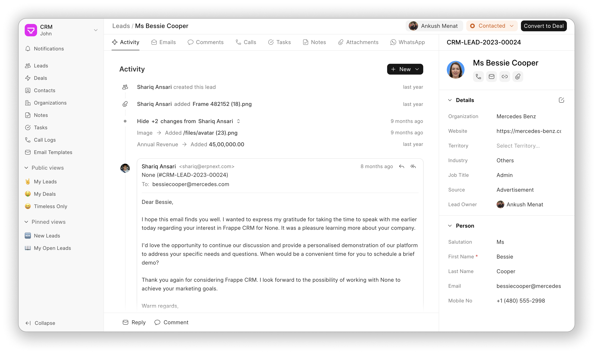

<div align="center">
    <a href="https://frappe.io/products/crm">
        
    </a>
</div>

<p align="center">
    <a href="https://img.shields.io/github/issues/frappe/crm">
        
    </a>
    <a href="https://img.shields.io/github/license/frappe/crm">
        
    </a>
</p>

<details>
    <summary>Show more screenshots</summary>
    
    
    
    
    
</details>

## Key Features

-   **Views:** Create custom views which is a combination of filters, sort and columns.
    -   **Pinned View:** Pin important leads and deals in the sidebar.
    -   **Public View:** Share views with all users.
    -   **Saved View:** Save views for later use.
-   **Email Communication:** Send and receive emails directly from the Lead/Deal Page.
-   **Email Templates:** Create and use email templates for faster communication.
-   **Comments:** Add comments to leads and deals to keep track of the conversation.
-   **Notifications:** Get notified when someone mentions you in a comment.
-   **Service Level Agreement:** Set SLA for leads and deals and get notified when the SLA is breached.
-   **Assignment Rule:** Automatically assign leads and deals to users based on the criteria.
-   **Tasks:** Create tasks for leads and deals.
-   **Notes:** Add notes to leads and deals.
-   **Call Logs:** See the call logs with call details and recordings.

## Integrations

-   **Twilio:** Integrate Twilio to make and receive calls from the CRM. You can also record calls. It is a built-in integration.
-   **WhatsApp:** Integrate WhatsApp to send and receive messages from the CRM. [Frappe WhatsApp](https://github.com/shridarpatil/frappe_whatsapp) is used for this integration.

## Getting Started

### Managed Hosting

Get started with your personal or business site with a few clicks on [Frappe Cloud](https://frappecloud.com/marketplace/apps/crm).

### Docker (Recommended)

The quickest way to set up Frappe CRM and take it for a test ride.

Frappe framework is multi-tenant and supports multiple apps by default. This docker compose is just a standalone version with Frappe CRM pre-installed. Just put it behind your desired reverse-proxy if needed, and you're good to go.  
  
If you wish to use multiple Frappe apps or need multi-tenancy. Take a look at our production ready self-hosted workflow, or join us on Frappe Cloud to get first party support and hassle-free hosting.

**Step 1**: Setup folder and download the required files

    mkdir frappe-crm
    cd frappe-crm

**Step 2**: Download the required files

Docker Compose File:

    wget -O docker-compose.yml https://raw.githubusercontent.com/frappe/crm/develop/docker/docker-compose.yml

Frappe CRM bench setup script

    wget -O init.sh https://raw.githubusercontent.com/frappe/crm/develop/docker/init.sh

**Step 3**: Run the container and daemonize it

    docker compose up -d

**Step 4**: The site [http://crm.localhost](http://crm.localhost) should now be available. The default credentials are:

> username: administrator  
> password: admin

### Self-hosting

If you prefer self-hosting, follow the official [Frappe Bench Installation](https://github.com/frappe/bench#installation) instructions.

## Want to Just Try Out or Contribute?

### Codespaces

1. Open [this link](https://github.com/codespaces/new?hide_repo_select=true&ref=master&repo=668199241&skip_quickstart=true&machine=standardLinux32gb&devcontainer_path=.devcontainer%2Fdevcontainer.json&geo=SoutheastAsia) and click on "Create Codespace".
2. Wait for initialization (~15 mins).
3. Run `bench start` from the terminal tab.
4. Click on the link beside "8000" port under "Ports" tab.
5. Log in with "Administrator" as the username and "admin" as the password.
6. Go to `<random-id>.github.dev/crm` to access the crm interface.

### Local Setup

1. [Install Bench](https://github.com/frappe/bench).
2. Install Frappe CRM app:
    ```sh
    $ bench get-app crm
    ```
3. Create a site with the crm app:
    ```sh
    $ bench --site sitename.localhost install-app crm
    ```
4. Open the site in the browser:
    ```sh
    $ bench browse sitename.localhost --user Administrator
    ```
5. Access the crm page at `sitename.localhost:8000/crm` in your web browser.

## Need help?

Join our [telegram group](https://t.me/frappecrm) for instant help.

## Documentation

Check out the [official documentation](https://docs.frappe.io/crm) for more details.

## License

[GNU Affero General Public License v3.0](LICENSE)
